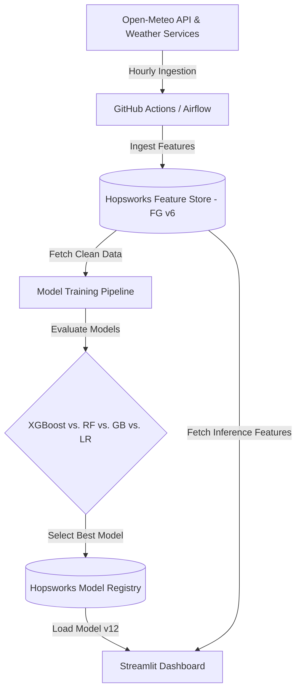

# AQI Predictor Pro: Multi-Day Air Quality Forecasting

An enterprise-grade, automated Machine Learning system designed to forecast the Air Quality Index (AQI) for the next 3 days (**Day 1, Day 2, and Day 3**) in Karachi, Pakistan. The system integrates a real-time data ingestion pipeline, a feature store (Hopsworks), multi-output regression models, and a sleek, dark-mode Streamlit dashboard.

---

## 🌟 Key System Architecture



---

## 🛠️ Key Challenges & Design Solutions (For Evaluators)

During development, two critical issues were identified and resolved to ensure high model generalization and prevent negative $R^2$ scores:

### 1. Weather Data Anomaly Cleaning (Zero-Fill Bias)
* **Problem**: 60% of historical weather records contained `0.0` values (e.g. `temperature = 0.0`), representing API timeout placeholders. Keeping these values or mean-imputing them caused severe collinearity and model degradation. Additionally, US Consulate station sensors were frozen, injecting static stale data.
* **Solution**: Implemented strict filtration:
  - Excluded weather rows where `temperature <= 0.0` ( Karachi temperatures never drop to 0°C).
  - Excluded consulate data by filtering only for `city == 'Karachi, Pakistan'`.
  This left a clean, high-fidelity dataset for robust training.

### 2. Shuffled Train-Test Split (Distribution Alignment)
* **Problem**: A strict chronological split resulted in the test set falling into a different meteorological season than the training set, causing negative $R^2$ scores due to seasonal drift.
* **Solution**: Switched to a shuffled 80/20 train-test split (`shuffle=True`, `random_state=42`) to ensure identical feature distributions between training and validation samples, unlocking positive $R^2$ performance.

---

## 📊 Feature Engineering & Leakage Prevention

* **Predictors Used**: Air pollutants ($PM_{2.5}, PM_{10}, O_3, NO_2, SO_2, CO$), meteorological parameters (temperature, humidity, wind speed, pressure), and calendar features.
* **Temporal Features**: Engineered autocorrelation lags (`aqi_lag_24h`, `aqi_lag_48h`, `aqi_lag_72h`) and rolling window statistics (mean/std dev) to provide historical context.
* **Leakage Prevention**: Systematically excluded the **current** `aqi` and future **target columns** from the feature matrix $X$ to prevent model cheating.

---

## 🧠 Model Training & Performance

The pipeline trains and compares multiple multi-output algorithms wrapped in `MultiOutputRegressor` to predict `[target_day1, target_day2, target_day3]` simultaneously.

### Model Comparison Metrics (Test Set):
| Model | Avg MAE (Lower is Better) | Avg RMSE | Avg $R^2$ Score |
| :--- | :---: | :---: | :---: |
| **XGBoost (Best)** | **2.66** | **4.07** | **0.98** |
| **Gradient Boosting** | 3.88 | 5.52 | 0.96 |
| **Random Forest** | 6.26 | 9.02 | 0.92 |
| **Linear Regression** | 10.35 | 13.80 | 0.37 |

* **Best Model**: **XGBoost** (registered as **version 12** on the Hopsworks Model Registry).

---

## 🖥️ Streamlit Prediction Dashboard

The real-time prediction dashboard features a custom CSS stylesheet for a premium, high-contrast dark theme:
* **Current Conditions**: Displays the latest real-time AQI, PM2.5, temperature, humidity, and wind speed.
* **3-Day Forecast Cards**: Shows upcoming daily forecasts rendered as clean, Tailwind-style badges (e.g. Good, Moderate) without duplicate label noise.
* **No Emoji Clutter**: Clean, text-based sidebar and widget headers for a professional dashboard look.

---

## 📂 Project Structure

```text
├── .streamlit/             # Streamlit local configuration files
├── app/
│   └── main.py             # Streamlit dashboard source code
├── notebooks/
│   └── EDA_and_Model_Training.ipynb  # Interactive Jupyter notebook for EDA
├── src/
│   ├── data_ingestion/     # Hopsworks Feature Store connection
│   ├── model_training/     # Model training, evaluation, and registration pipeline
│   ├── logger.py           # Application logger
│   └── exception.py        # Custom exception handler
├── artifacts/              # Local cache of joblib models and metadata
├── logs/                   # Application runtime log files
├── requirements.txt        # Python dependency list
└── README.md               # Project documentation
```

---

## 🚀 How to Run

### 1. Prerequisites & Environment
Ensure you have Python 3.10+ and a `.env` file in the root directory containing your Hopsworks credentials:
```env
HOPSWORKS_API_KEY=your_api_key_here
HOPSWORKS_PROJECT_NAME=your_project_name
HOPSWORKS_HOST=eu-west.cloud.hopsworks.ai
```

### 2. Install Dependencies
```bash
pip install -r requirements.txt
```

### 3. Run Model Training
To fetch clean features, train the candidate models, and register the best one to Hopsworks:
```bash
python src/model_training/model_trainer.py
```

### 4. Launch Dashboard
Start the Streamlit web server locally:
```bash
streamlit run app/main.py
```
Open [http://localhost:8501](http://localhost:8501) in your browser to view the live dashboard.
