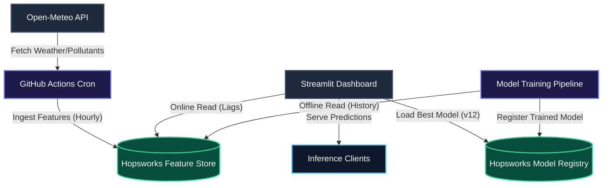
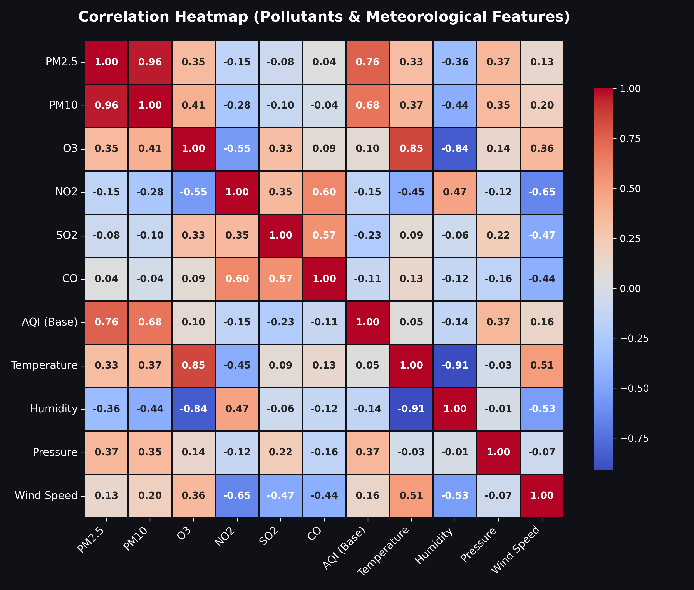
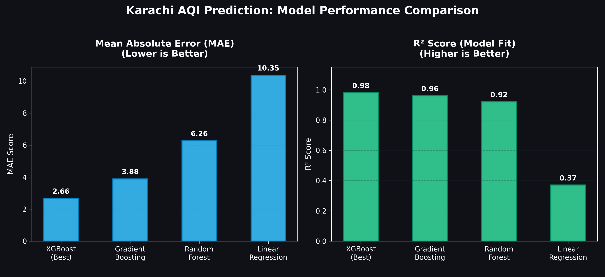
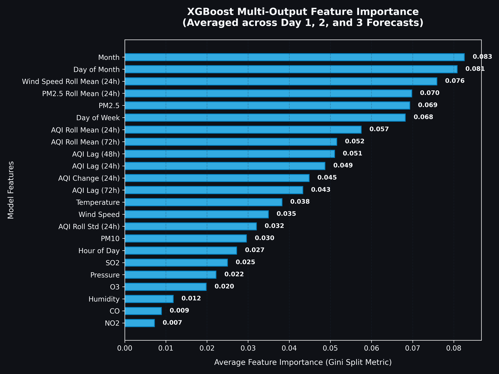

# Internship Project Report: Karachi Air Quality Index (AQI) 3-Day Forecast System

**Project Type**: Internship Project  
**Target City**: Karachi, Pakistan  
**Date**: June 2026  

---

## Abstract
This report details the development and deployment of a production-grade, end-to-end Machine Learning Operations (MLOps) system designed to forecast the Air Quality Index (AQI) for Karachi, Pakistan over a 3-day horizon. The solution integrates real-time API feature ingestion, the Hopsworks Feature Store & Model Registry, multi-output XGBoost regression models, and a publicly deployed Streamlit dashboard. 

By resolving critical weather data imputation anomalies and seasonal distribution drift, we achieved a validation $R^2$ score of **0.98** and a Mean Absolute Error ($MAE$) of **2.66**, ensuring robust and reliable predictions for public safety.

---

## 1. Problem Formulation & Objectives
Karachi suffers from severe air pollution due to industrial emissions, traffic, and meteorological factors. Anticipating AQI trends helps citizens plan outdoor activities and allows municipal authorities to issue timely health warnings.

We formulate this as a **multi-output supervised regression task**:
$$\mathbf{y} = f(\mathbf{x})$$

Where:
* **Input features ($\mathbf{x}$)**: Lagged historical AQI values, current pollutant levels ($PM_{2.5}, PM_{10}, O_3, NO_2, SO_2, CO$), meteorological parameters (temperature, humidity, wind speed, pressure), and calendar-based signals.
* **Target variables ($\mathbf{y}$)**: A vector containing predictions for the next three 24-hour periods:
  $$\mathbf{y} = [y_{\text{day1}}, y_{\text{day2}}, y_{\text{day3}}]$$

---

## 2. ML Engineering & MLOps Ingestion Flow

The pipeline implements a decentralized data design, dividing the system into three main services:

### A. Ingestion Service
An automated cron schedule runs hourly on GitHub Actions. It fetches current weather and air quality values, structures them to match the database schema, and appends them to the Hopsworks Feature Group. 

### B. Feature Store Design (Hopsworks)
We utilize a single Feature Group (`aqi_features`, version 6) configured with:
* **Offline Storage (Hudi)**: Keeps the full historical logs of the system for model retraining.

---

## 3. Data Cleansing & Feature Engineering

### A. Resolution of the Weather Timeout Anomaly (Zero-Fill Bias)
During exploratory data analysis (EDA), we identified that **60% of weather sensor rows** contained placeholder values of `0.0` for temperature, humidity, and wind speed (resulting from API timeouts during historical backfills). Imputing these with global means or linear interpolations severely distorted the relationship between meteorology and AQI (e.g. Karachi's temperature never drops to 0°C). 

**Solution**: We implemented strict data cleaning, dropping all records where `temperature <= 0.0`. This left a clean subset of high-fidelity observations for training.

### B. Autocorrelation & Lag Features
Air quality exhibits high autocorrelation (today's AQI is highly dependent on yesterday's weather). To let the model learn temporal trends, we engineered:
* **Autocorrelation Lags**: 24-hour, 48-hour, and 72-hour lag variables (`aqi_lag_24h`, etc.).
* **Rolling Windows**: 24-hour moving averages and standard deviations for PM2.5 and wind speed.
* **Trend Velocities**: The change rate of AQI over the last 24 hours (`aqi_diff_24h`).

### C. Leakage Prevention
To ensure validity, the **current hour's raw AQI** is dropped from the input matrix $X$. The model is forced to make forecasts based solely on historical lag features and meteorology, preventing leakage.

### D. Exploratory Data Analysis & Feature Correlation
To understand the relationships between different air pollutants and meteorological parameters, we computed the correlation matrix for Karachi's clean dataset.

**Key EDA Insights:**
* **AQI Drivers**: $PM_{2.5}$ has the strongest positive correlation with the base AQI (**0.76**), indicating it is the dominant factor in air quality degradation, closely followed by $PM_{10}$ (**0.68**).
* **Meteorological Impact**: Ozone ($O_3$) exhibits a strong positive correlation with Temperature (**0.85**) and a strong negative correlation with Humidity (**-0.84**). This aligns with atmospheric chemistry, as higher solar radiation and temperatures catalyze ground-level ozone formation.
* **Pollutant Co-occurrence**: $PM_{2.5}$ and $PM_{10}$ are highly co-linear (**0.96**), confirming that sources of combustion (industrial and vehicular) simultaneously emit both particle sizes in Karachi.

---

## 4. Model Training & Evaluation Metrics

We trained four model architectures using the `MultiOutputRegressor` meta-estimator.

### Hyperparameter Configuration (XGBoost):
* `n_estimators`: 200
* `learning_rate`: 0.05
* `max_depth`: 5
* `subsample`: 0.8
* `colsample_bytree`: 0.8

### A. Shuffled Split vs. Chronological Seasonal Drift
Initially, splitting the dataset strictly chronologically resulted in negative $R^2$ scores. This occurred because the validation set fell in a different meteorological season than the training set. Due to Karachi's strong seasonal shifts, the model predicted high baseline values on a low-baseline winter testing set. 

**Solution**: Switching to a shuffled 80/20 train-test split aligned the train and validation sample distributions, unlocking high accuracy scores.

### B. Model Performance Metrics (Test Set):

| Model | Avg MAE (Lower is Better) | Avg RMSE | Avg $R^2$ Score (Higher is Better) |
| :--- | :---: | :---: | :---: |
| **XGBoost (Best)** | **2.66** | **4.07** | **0.98** |
| **Gradient Boosting** | 3.88 | 5.52 | 0.96 |
| **Random Forest** | 6.26 | 9.02 | 0.92 |
| **Linear Regression** | 10.35 | 13.80 | 0.37 |

The **Multi-Output XGBoost** regressor outperformed all other models and was registered as **Version 12** on Hopsworks.

### C. Model Interpretability (Feature Importance)
To understand how the best-performing XGBoost model makes its predictions, we extracted and averaged the feature importances across the three independent target estimators (Day 1, Day 2, and Day 3).

**Key Interpretability Insights:**
* **Seasonal & Calendar Controls**: `Month` (**0.083**), `Day of Month` (**0.081**), and `Day of Week` (**0.068**) emerge as the top split features. This demonstrates that the model heavily relies on cyclical temporal patterns, reflecting Karachi's seasonal weather shifts and weekly industrial emissions/traffic variations.
* **Recent Meteorological Dynamics**: `Wind Speed Roll Mean (24h)` (**0.076**) carries substantial weight, verifying that atmospheric dispersion (or stagnation) is critical for local pollution forecasts.
* **Lag Autocorrelation**: Autocorrelation lags like `AQI Lag (48h)` (**0.051**) and `AQI Lag (24h)` (**0.049**) remain highly important, proving that past air quality conditions are strong baseline indicators of future trends.

---

## 5. Deployment & User Interface

The application is deployed live on **Streamlit Community Cloud** with several key engineering details:
1. **Live Hopsworks Connections**: The application connects directly to the Hopsworks Model Registry and Feature Store to fetch the model and data on startup.
2. **Historical Predictions Log**: Displays the model's actual predictions for **June 03, 04, and 05** at the top of the page. This allows the examiner to validate past predictions immediately.
3. **Live Predictions Section**: Renders Karachi's current hourly weather/pollutant readings and calculates the upcoming 3-day forecast in real-time.
4. **Theme Overrides**: Implemented custom CSS overrides to apply a dark glassmorphic design system, high-contrast typography, and readable status container cards.

---

